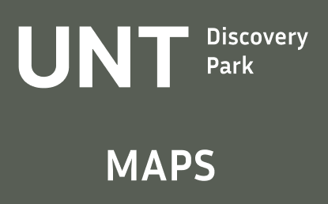
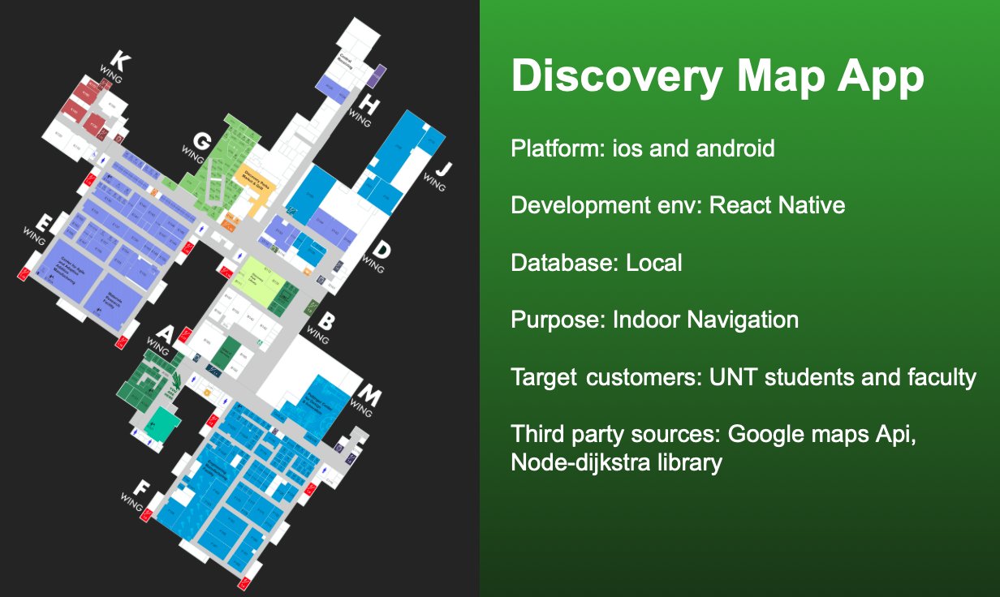
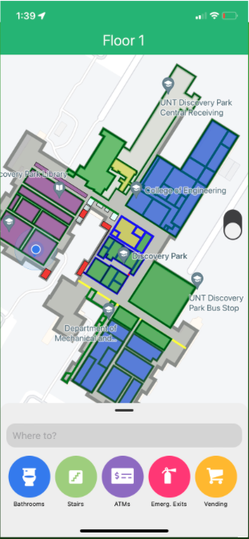
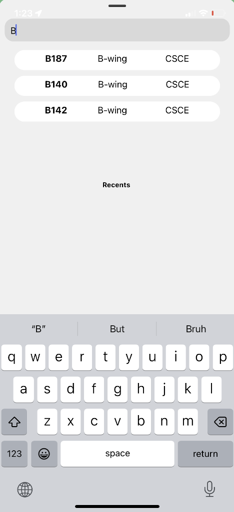
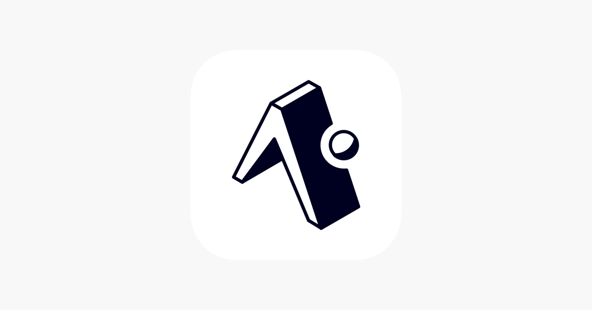
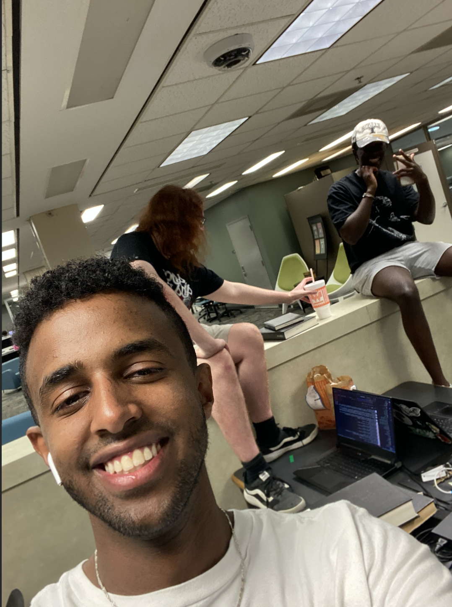
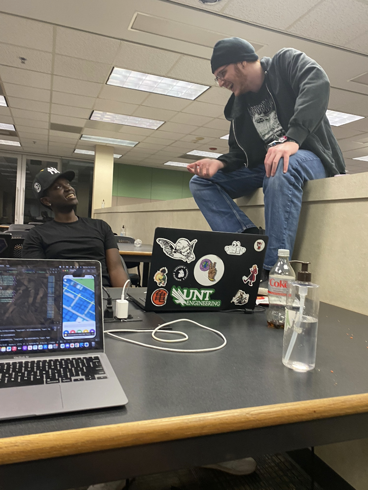
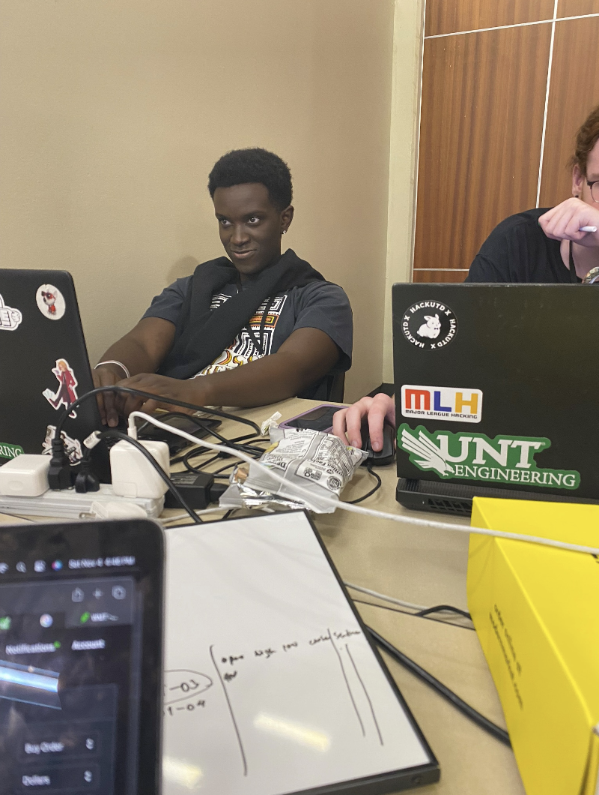
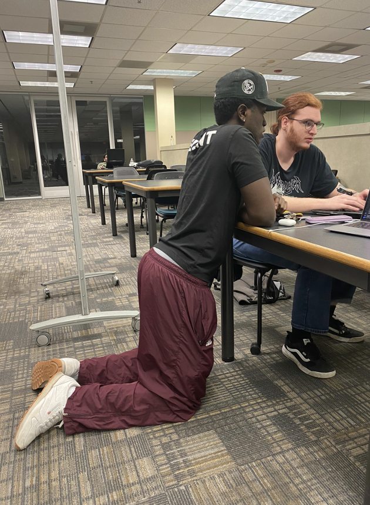
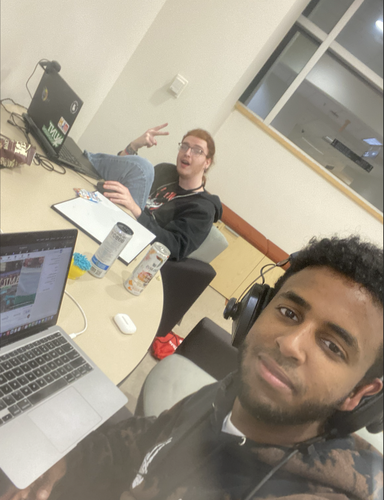

# Discovery Park Map App



A mobile application designed to help university students navigate the College of Engineering campus, find resources like restrooms, vending machines, and more, using real-time pathfinding.

## 📚 Table of Contents
* [Overview](#overview)
* [Features](#features)
* [Platforms and Technologies](#platforms-and-technologies)
* [Scope](#scope)
* [Requirements](#requirements)
* [Installation and Usage](#installation-and-usage)
* [Contributing](#contributing)
* [Future Improvements](#future-improvements)
* [Lessons Learned](#lessons-learned)

## 📝 Overview


The **Discovery Park Map App** uses **Dijkstra's algorithm** to find the shortest path between two locations within the College of Engineering campus. The app is designed to make it easier for incoming students and faculty to navigate the building and find essential resources such as bathrooms, vending machines, and more.

### Key Highlights

* Indoor navigation using real-time directions
* Find specific resources like restrooms, ATMs, and more
* Cross-platform app available on both iOS and Android

## ✨ Features
     

* **Browsable Map**: View detailed floor plans of the building
* **Filter Bar**: Filter resources like bathrooms, stairs, ATMs, emergency exits, and vending machines
* **Search Bar**: Search for rooms and resources quickly
* **Floor Toggle**: Toggle between different floors of the building
* **Recent Routes**: Access recently used routes for quick navigation
* **Favorite Destinations**: Save favorite locations for easy access


## 🛠 Platforms and Technologies
The **Discovery Park Map App** utilizes a variety of technologies to ensure a seamless and efficient experience across multiple platforms. Below is an overview of the key technologies and platforms used in the development process.

<p>
                          
</p>

* **Platform**: iOS and Android  
  The app is designed to be cross-platform, ensuring that it runs smoothly on both iOS and Android devices. This enables wide accessibility for all users within the university community.

* **Development Environment**: React Native  
  We used **React Native** for building the app's user interface. React Native allows for the development of cross-platform mobile applications using a single codebase, which streamlines the development process and maintains consistency across both platforms.

* **Database**: PostgreSQL (Local)  
  **PostgreSQL** is used for storing user data, including search history, favorite destinations, and recent routes. We opted for a local database to ensure fast access to data and to minimize reliance on external servers. PostgreSQL provides the robustness and flexibility needed for the app’s data storage requirements.

* **Navigation Algorithm**: Dijkstra’s Algorithm  
  The app leverages **Dijkstra's Algorithm** to calculate the shortest path between two nodes (e.g., rooms or resources) on the campus map. This ensures that users can get precise and efficient directions for indoor navigation.

* **Backend Framework**: Node.js with Express  
  The backend is powered by **Node.js** with **Express** for handling requests, routing, and serving data to the frontend. This lightweight server ensures quick data retrieval and response times for the user.

* **Map Integration**: Custom Indoor Map  
  For the map feature, we integrated custom indoor maps that allow users to explore different floors and rooms within Discovery Park. The maps are interactive and dynamically updated based on user input, showing their location in real-time.

* **Version Control**: Git & GitHub  
  We used **Git** for version control and **GitHub** for collaboration and source code management. This allowed the team to efficiently work on the app, manage different branches, and keep track of changes in the codebase.

* **Deployment**: Expo for React Native  
  **Expo** is used for developing and building the React Native app. It simplifies the setup process and provides powerful development tools for testing and building the app on iOS and Android devices without needing a native build process.

## 🎯 Scope
The scope of this project encompasses the development of a cross-platform mobile application (iOS and Android) for indoor navigation. The app will enable users to:

* Access detailed indoor maps and floor plans
* Receive directions to their desired destinations
* Explore points of interest (POIs) within the building
* Search for specific locations and POIs
* Ensure user-friendly accessibility

## 📋 Requirements

* The system shall allow the user to search for a destination from a list of classrooms
* The system shall offer navigation for the user from their current location to their destination
* The system shall allow users to filter and show: Bathrooms, Stairs, ATMs, Emergency Exits, and Vending Machines
* The system shall provide a uniform look and feel across the application

## ⚙️ Installation and Usage

### Steps
1. Clone the repository:
    ```bash
    git clone https://github.com/MichaelClark02/DiscoveryParkMapApp.git
    cd DiscoveryParkMapApp
    ```

2. Install dependencies:
    ```bash
    npm install
    ```

3. Start the development server:
    ```bash
    npm start
    ```

4. Follow the instructions in the terminal to run the app on your device or emulator.

## 🤝 Contributing
We welcome contributions to improve the app! Here's how you can get started:

1. Fork the repository
2. Create a new branch for your feature or fix
3. Commit and push your changes
4. Submit a pull request with a detailed explanation of your work

## 🚀 Future Improvements

* Mapping more wings of Discovery Park
* Expanding on directions with common navigation features (e.g., voice over directions, showing next steps at the top of the screen)

## 💡 Lessons Learned
* How to utilize the Agile methodology to develop quickly
* The workflow for mobile app development
* Usability and UI Design

## 📄 License
This project is licensed under the MIT License. See the [LICENSE](LICENSE) file for more details.

## 💬 Credits
Special thanks to everyone who contributed to the app's development, including the students, faculty, and other contributors. This project was developed to enhance the campus experience for students and faculty alike.

 
 
 

